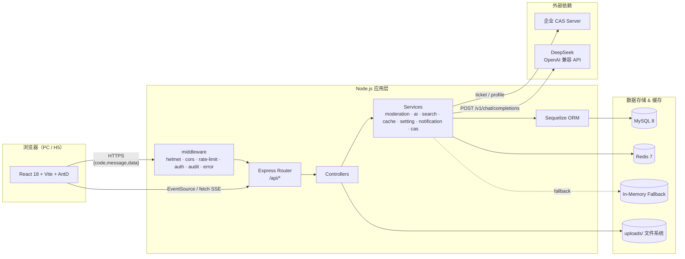
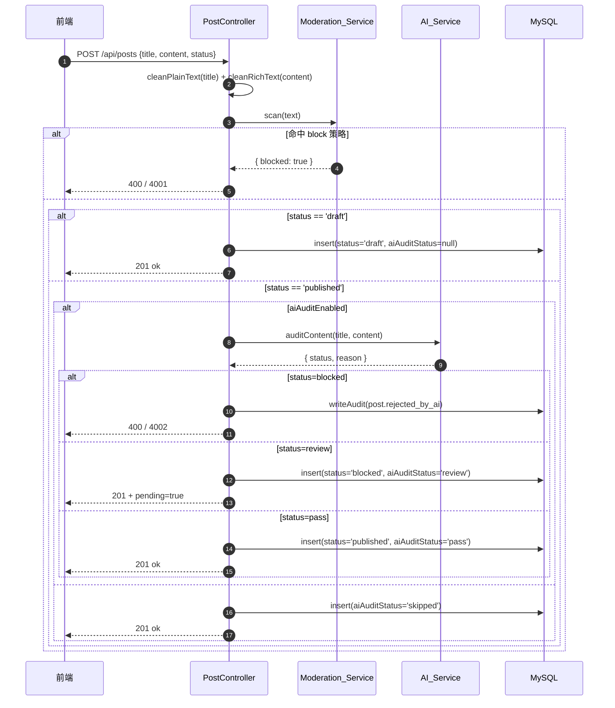
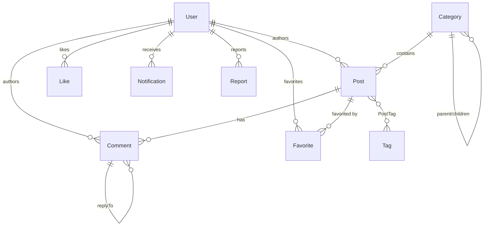

# Design Document

## Overview

**Community_Platform**（企业级技术交流分享社区）是一个面向企业内部员工的技术内容协作平台。本设计文档基于 [requirements.md](./requirements.md) 中的 27 项需求，对系统的架构、模块划分、数据模型、对外协议、关键算法、错误处理与测试策略进行系统化定义，与 `backend/src` 与 `frontend/src` 中的既有实现对齐，作为后续迭代与验收的工程基线。

设计的核心主线是 **"看 / 写 / 问 / 管"**：

- **看**：分类树 + 帖子列表 + 全文搜索 + 排序筛选 + 帖子详情。
- **写**：富文本编辑器 + 草稿/发布 + 标签 + 文件上传 + AI 写作助手。
- **问**：站内 RAG 问答（普通 + SSE 流式）+ 帖子 AI 解读 + 智能推荐。
- **管**：举报 / 置顶 / 加精 / 屏蔽 / 敏感词 / 系统设置 + 操作审计。

设计的核心非功能性目标是：

- **稳定降级**：Redis 不可用时降级到内存缓存；AI 不可用时审核降级到本地规则、`explain/ask/assist` 抛 `5001`；CAS 未配置时进入 Mock 模式。
- **结构化错误**：通过 `{ code, message, data }` 与一组业务码（`4001` / `4002` / `4003` / `4004` / `5001`）让前端能够分支处理 AI 与审核相关的失败。
- **可审计**：所有管理类敏感操作必须落 `AuditLog`。
- **一致性优先于性能**：强一致性的计数（`likeCount` / `commentCount` / `favoriteCount`）通过事务内 `increment / decrement` 维护，搜索与推荐场景允许最终一致。

## Architecture

### 系统拓扑



### 关键运行时模式

- **请求生命周期**：`helmet → cors → rate-limit → express.json(5MB) → router → authRequired/authOptional → controller → service → ORM → response.js → error middleware`。
- **认证模式**：JWT（`Authorization: Bearer <token>`），有效期 7 天；CAS 模式与 Mock 密码登录共享相同的 token 颁发函数。
- **多租户隔离**：单一企业部署，无租户字段；权限由 `Role` + `moderatorCategoryIds` 组合判定。
- **AI 调用模式**：所有 AI 入口共用 `auditContent` / `callLLMJSON` / `streamAnswer` 三个入口；统一通过 `AbortController + AI_TIMEOUT_MS` 控制超时；非流式使用 `response_format = json_object`；流式使用 `stream = true`，并在服务端解析 `data: <json>` 行。
- **降级策略**：
  - Redis → 内存缓存（透明，调用方无感知）。
  - LLM 审核 → 本地 `RISK_KEYWORDS`（auditContent 内嵌兜底）。
  - LLM `explain/ask/assist` → 不降级，直接抛错由控制器映射到 `5001`，业务允许失败。
  - CAS → Mock（用 `empNo + password` 走密码比对）。

### 部署形态

- **开发态**：`docker compose up -d` 启动 MySQL（host port 3316）+ Redis（host port 6380）；`npm run dev` 启动后端（4000）；`npm run dev` 启动前端（5173）；前端通过 Vite 代理或环境变量配置 API 基址。
- **生产态**：MySQL 与 Redis 由企业基础设施提供；后端单进程部署即可水平扩容（`Cache_Service` 共享 Redis 后无状态）；上传文件位于 `backend/uploads/`，生产建议挂载共享卷或对接对象存储。

## Components and Interfaces

下列模块对应需求文档 Glossary 中的同名术语，括号内为代码位置。

### 1. Auth_Service（`backend/src/controllers/authController.js`、`middlewares/auth.js`）

负责登录、CAS 回调、JWT 颁发与校验。

| 方法 | HTTP | 协议 | 关联需求 |
| --- | --- | --- | --- |
| `loginUrl` | `GET /api/auth/cas/login-url` | `{ mock, url }` | R1.1, R1.2 |
| `localLogin` | `POST /api/auth/login` | `{ empNo, password } → { token, user }` | R1.3, R1.4, R1.5 |
| `casCallback` | `GET /api/auth/cas/callback?ticket=...` | 重定向 + token 颁发 | R1.6, R1.7, R1.8 |
| `me` | `GET /api/auth/me` | 返回去敏 user | R1.12 |
| `logout` | `POST /api/auth/logout` | `{}` | R1.13 |
| `authRequired` / `authOptional` | middleware | 解析 Bearer，落到 `req.user` | R1.9–R1.11 |
| `requireRole(...roles)` | middleware | 角色白名单 | R2.6 |
| `canModerateCategory(user, categoryId)` | helper | `admin` 永真；`moderator` 看 `moderatorCategoryIds.includes(categoryId)` | R2.4, R14.6 |

**安全约束**：

- `authRequired` 与 `authOptional` 解析失败时，前者必须返回 401（`code=401`），后者把 `req.user = null` 后放行，给可匿名读接口使用。
- CAS Mock 模式与真实 CAS 共用同一登录响应结构；密码登录路径仅在 Mock 模式下生效（生产用 CAS 颁发 ticket，本路径不暴露给用户）。

### 2. CAS_Service（`backend/src/services/casService.js`）

抽象企业 CAS 协议；`CAS_SERVER_URL` 未配置时进入 Mock 模式。开放函数：

- `verifyTicket(ticket) → { empNo, name, department, email }`：真实 CAS 实现需对接 `/serviceValidate`，Mock 实现内置一组测试 ticket。
- `buildLoginUrl(serviceUrl) → string`：拼接 CAS 登录入口，Mock 模式下返回前端登录页地址。

### 3. Post_Service（`controllers/postController.js`）

负责帖子的 CRUD、状态切换与管理动作。关键流程：



对外接口（节选，完整在 `routes/index.js`）：

| 路由 | 鉴权 | 关联需求 |
| --- | --- | --- |
| `GET /api/posts` | 可选 | R7 |
| `GET /api/posts/recommend` | 必选 | R16 |
| `GET /api/posts/:id` | 可选 | R5.11–R5.14 |
| `GET /api/posts/:id/explain` | 必选 | R17 |
| `POST /api/posts` | 必选 | R5.1–R5.6, R12 |
| `PUT /api/posts/:id` | 必选 | R5.7–R5.9 |
| `DELETE /api/posts/:id` | 必选 | R5.10 |
| `POST /api/posts/:id/like` | 必选 | R9.1, R9.2 |
| `POST /api/posts/:id/favorite` | 必选 | R9.3 |
| `POST /api/admin/posts/:id/{pin,feature,block}` | `admin/moderator` | R14 |

### 4. Comment_Service（`controllers/commentController.js`）

实现评论列表、创建、删除、点赞，处理引用回复（`replyToId`）。重要约束：

- 列表必须先在数据库层面 `where: { status: { [Op.ne]: 'deleted' } }` 过滤，再做关联与点赞状态拼装（R8.1）。
- 创建时同时执行 `Moderation_Service` 与 `AI_Service.auditContent`，错误码与帖子一致（4001 / 4002）。
- 评论 `review` 时持久化为 `status='blocked'` 并响应 `pending=true`（R8.8）。
- `commentCount` 在创建（非 review）与删除时维护一致性。

### 5. Interaction_Service（嵌入 `postController.js` / `commentController.js`）

切换点赞 / 收藏，维护 `Post.likeCount` / `Post.favoriteCount` / `Comment.likeCount`：

- `Like` 表为多态（`postId` 或 `commentId`，二选一非空）。
- 切换语义：先查存在性 → 删则 `decrement`，新增则 `increment`，必须在事务内完成或借助 `findOrCreate + destroy` 保证幂等。
- 仅在"未赞 → 已赞"时触发 `notify('liked')`，避免重复通知。

### 6. Search_Service（`backend/src/services/searchService.js`）

提供两类查询：

- `searchPosts({ keyword, categoryId, authorId, tag, sort, page, pageSize })`：返回分页 published 帖子；`pageSize` 上限 50；`tag` 过滤通过 `Tag.name` 强制 `required: true` 关联。
- `searchForRAG({ question, topN })`：服务于 R18/R19。
  - 分词：中英文混合切分，移除停用词（≤1 字符的英文/数字、纯空白）。
  - 召回：在 `title / content / summary` 三字段做多关键词 OR `LIKE` 召回，`status = 'published'`。
  - 评分：`title 命中 × 5 + content 命中次数（封顶 5） + log(1 + likeCount + commentCount)`。
  - 取 Top-N：`topN = clamp(req.topN, 3, 8)`，默认 5。

### 7. Moderation_Service（`services/moderationService.js`）

敏感词加载与策略执行：

- 缓存：进程内 `Map<word, strategy>`，首次调用时从 `SensitiveWord` + `.env SENSITIVE_WORDS` 合并加载；`invalidate()` 清空。
- 策略：`mask` / `block` / `review`，遵循 R11 的语义；同一文本可同时命中多种策略，`blocked` 与 `needReview` 是相互独立的输出。
- 输出：`{ cleanText, hits: [{ word, strategy }], blocked, needReview }`。
- 不命中时输出 `{ cleanText: 原文, hits: [], blocked: false, needReview: false }`。

### 8. AI_Service（`services/aiService.js`）

封装 DeepSeek（OpenAI 兼容）调用，统一超时与降级。导出：

| 函数 | 用途 | 关联需求 | 失败行为 |
| --- | --- | --- | --- |
| `auditContent({ title, content })` | 内容审核 | R12 | LLM 失败时降级 `RISK_KEYWORDS` 规则，永远返回 `{ status, reason }` |
| `recommendPosts(user, limit)` | 标签推荐 | R16 | 异常向上抛，控制器降级为热门 |
| `explainPost({ title, content })` | 帖子解读 | R17 | 抛错由控制器映射 `5001` |
| `askWithRAG(question, sources)` | RAG 非流式 | R18 | 同上 |
| `streamAnswer(question, sources, onChunk)` | RAG 流式 | R19 | 通过 `onChunk('error', ...)` 上报 |
| `assistTitle / summarize / explainCode` | 写作助手 | R20 | 同上 |

**关键不变量**：

- 所有非流式调用强制 `temperature = 0~0.5` + `response_format = json_object` + `safeParseJSON` 容错（兼容模型偶尔包 markdown 代码块）。
- 所有调用使用 `AbortController` + `AI_TIMEOUT_MS`（默认 15000ms），流式接口允许 `2 × AI_TIMEOUT_MS` 兼顾 Token 速率。
- `askWithRAG` 与 `streamAnswer` 共享同一上下文拼装规则：`[n] 帖子#id 《标题》` 头 + `分类: x 作者: y` 元 + 正文片段 ≤ 800 字。
- 引用解析（重要）：从模型回答中正则匹配 `\[(\d{1,2})\]`，仅保留 `1 ≤ n ≤ candidates.length` 的编号，按首次出现顺序去重，再映射回 `candidates[n-1].id` 形成 `citedSourceIds`，越界编号忽略（R19.6）。
- 配额计费：在"召回非空 → 即将向 LLM 发起首次请求"之前 `+1`；召回为空、前置校验失败、缓存命中均不 `+1`；`error` 与客户端中断不回滚（R19.8）。

### 9. Notification_Service（`services/notificationService.js`）

写入 `Notification` 表，支持 6 种 `type`（`commented / replied / liked / featured / pinned / system`）；`unreadCount` 通过 `count({ where: { read: false } })` 计算。

- 触发点：评论创建（`commented` + 可选 `replied`）；点赞由"未赞 → 已赞"切换；版主/管理员的 `pin / feature` 动作。
- 前端轮询：30s 一次 `GET /api/notifications?unreadOnly=1`，但页面挂载时立即查询一次，不等待首轮（R15.7）。
- `emailNotify` 字段仅作偏好持久化，不在本期发送邮件（R15.8）。

### 10. Report_Service（`controllers/reportController.js`）

举报创建与管理员处理：

- 创建：仅校验 `targetType ∈ {post, comment}`、`targetId` 与 `reason` 非空，`reason` 截断 255。
- 处理：`action ∈ {block, reject}`；`block` 时切换目标 `status = 'blocked'`，`reject` 时仅状态流转。
- 审计：`block` 写 `report.block`，`reject` 写 `report.reject`。

### 11. Admin_Console（`controllers/adminController.js` + 前端 `pages/AdminPage.jsx`）

聚合 `/api/admin/*` 的总览、用户管理、敏感词、设置、AI 测试、审计日志查询。其中 `PUT /api/admin/users/:id/role` 必须执行三类校验：取值合法性、`moderatorCategoryIds` 整数数组且对应的 Category 实际存在（≤50 项）、不允许把自身降级（R2.7–R2.9）。

### 12. Setting_Service（`services/settingService.js`）

KV 设置存储 + 内存缓存：

- 仅接受 `DEFAULTS` 中声明的 7 个 key（R21.2）。
- 写入：`JSON.stringify(value)` 入 `SystemSetting.value`；写入成功后 `invalidate()` 缓存；写入失败保留旧缓存（R21.4）。
- AI 测试入口 `POST /api/admin/ai/test`：用内置正常样本调 `auditContent`，返回 `{ provider, model, apiKeyConfigured, elapsedMs, result }`；异常抛 500/`code=500`（R21.6, R21.7）。

### 13. Cache_Service（`services/cacheService.js`）

统一接口：`get(key) / set(key, value, ttlSec) / del(key) / incr(key, ttlSec)`。

- 后端选择：`REDIS_URL` 配置且连接成功 → Redis；否则 → 内存 `Map + setTimeout` 模拟 TTL。
- 切换对调用方透明，调用方只面对接口语义。
- 配额计数键：`ai:<feature>:quota:<userId>:<YYYY-MM-DD>`，TTL 24h。
- 解读缓存键：`ai:explain:post:<postId>:<updatedAtTs>`，TTL 24h。
- 问答缓存键：`ai:ask:<sha1(question.toLowerCase()).slice(0,16)>`，TTL 1h。

### 14. Audit_Log（`models/AuditLog.js` + `middlewares/audit.js`）

`writeAudit(req, { action, targetType, targetId, detail })` 落库；R22.5 列出的全部事件均必须落 `AuditLog`。`GET /api/admin/audit-logs` 按 `createdAt DESC` 分页，附 `operator: { id, name, empNo }`。

### 15. 文件上传（`controllers/uploadController.js`）

`multer.diskStorage` + 扩展名白名单 `{.png, .jpg, .jpeg, .gif, .webp, .svg}` + `MAX_UPLOAD_MB`（默认 10）；同时强制扩展名校验与大小校验，任一失败即返回错误（R10.5）；成功响应 `{ url, originalName, size }`，URL 形如 `/uploads/<ts>-<uuid><ext>`。

### 16. 前端模块（`frontend/src/`）

- `api/http.js` 统一 axios 实例：注入 `Authorization`、统一处理 401（清 token 跳登录）、统一解包 `{ code, message, data }` 为 `data`。
- `pages/HomePage.jsx`：分类树、帖子列表、搜索、排序切换、AI 推荐入口、AI 问答抽屉。
- `pages/PostDetailPage.jsx`：富文本渲染（`RichContent`，含懒加载图片与代码高亮）+ 评论树 + 点赞收藏分享 + AI 解读。
- `pages/PostEditPage.jsx`：`RichEditor`（兼容 IME `compositionstart/end`）+ 标签输入 + 草稿/发布 + 写作助手按钮。
- `pages/AdminPage.jsx`：用户、分类、敏感词、举报、设置（Switch / InputNumber）、审计日志 6 个子页签。
- `components/AskAiDrawer.jsx`：流式问答 UI，使用 `fetch + reader` 而非 `EventSource`（POST + Authorization 头），逐行解析 SSE 帧。
- `store/auth.js`：Zustand 持久化 `token + user`。

## Data Models

下表枚举核心字段；完整定义见 `backend/src/models/*.js`。



### User
- `id` PK, `empNo` UNIQUE, `passwordHash`（仅 Mock 用）, `name`, `nickname`, `email`, `department`, `avatar`, `bio`, `techTags`（逗号分隔字符串）, `role ∈ {user,moderator,admin}`, `status ∈ {active,disabled}`, `moderatorCategoryIds`（JSON / TEXT 序列化整数数组）, `emailNotify`, `lastLoginAt`。
- 序列化时统一去掉 `passwordHash`（R1.5, R22.3）。

### Category
- `id` PK, `name`, `description`, `icon`, `parentId`（自关联，最多两级，R4.1）, `sort`, `enabled`, `visibility`（JSON 字符串，可空）。

### Post
- `id` PK, `authorId` FK, `categoryId` FK, `title`(≤200), `content`（清洗后 HTML）, `summary`（自动生成）, `status ∈ {draft,published,blocked,deleted}`, `pinned ∈ {0,1,2}`, `featured` BOOL, `viewCount`, `likeCount`, `commentCount`, `favoriteCount`, `aiAuditStatus ∈ {pass,review,blocked,skipped,null}`, `aiAuditReason`, `createdAt`, `updatedAt`。

### Comment
- `id` PK, `postId` FK, `authorId` FK, `replyToId` 自关联可空, `content`（清洗后）, `likeCount`, `status ∈ {active,blocked,deleted}`。

### Like
- `id` PK, `userId` FK, `postId` 可空, `commentId` 可空（多态，二选一非空，UNIQUE 复合索引保证幂等）。

### Favorite
- `id` PK, `userId` FK, `postId` FK, UNIQUE(`userId`,`postId`)。

### Tag / PostTag
- `Tag`: `id`, `name` UNIQUE(≤32), `usageCount`。
- `PostTag`: `postId` FK, `tagId` FK, UNIQUE(`postId`,`tagId`)。

### Notification
- `id`, `userId`（接收者）, `fromUserId`（发起者，可空，用于 `system` 类）, `type ∈ {commented,replied,liked,featured,pinned,system}`, `title`, `content`, `targetType`, `targetId`, `read` BOOL, `createdAt`。

### Report
- `id`, `reporterId` FK, `targetType ∈ {post,comment}`, `targetId`, `reason`(≤255), `status ∈ {pending,resolved,rejected}`, `handledBy`, `handledAt`, `remark`。

### AuditLog
- `id`, `operatorId` FK, `action`（如 `post.create`、`setting.update`）, `targetType`, `targetId`, `detail`（JSON 字符串）, `ip`, `createdAt`。

### SensitiveWord
- `id`, `word` UNIQUE, `strategy ∈ {mask,block,review}`, `enabled`, `createdAt`。

### SystemSetting
- `key` PK, `value`（JSON 字符串）, `description`。仅允许 `aiAuditEnabled / aiExplainEnabled / aiExplainPerUserDailyLimit / aiAskEnabled / aiAskPerUserDailyLimit / aiAssistEnabled / aiAssistPerUserDailyLimit` 七个键。

### 关键派生数据
- `User.stats`：`{ postCount(published), likeReceived(SUM published.likeCount), favoriteCount }`，由 `getProfile` 在响应前聚合。
- `Notification.unreadCount`：`Notification.count({ where: { userId, read: false } })`。


## Correctness Properties

*A property is a characteristic or behavior that should hold true across all valid executions of a system — essentially, a formal statement about what the system should do. Properties serve as the bridge between human-readable specifications and machine-verifiable correctness guarantees.*

下列属性来自对 27 项需求的逐条 prework 分析（见 prework 上下文）。已对原始 84 条 acceptance criteria 做归并去重——许多条目是同一通用规则的不同表述（例如 1.5 / 1.12 / 22.3 都在说"响应永远不含 `passwordHash`"，5.11 / 5.12 / 17.2 / 17.3 都在描述"帖子可见性谓词"），合并后形成 36 条互不冗余、可验证的属性。

### Property 1: 任意接口响应都不泄漏 `passwordHash`

*For any* `/api/*` 接口在任意输入下产生的响应体（含成功与错误响应、含嵌套对象 `author`、`operator`、`reporter`、`fromUser` 等），其 JSON 序列化结果中均不应出现键名 `passwordHash`。

**Validates: Requirements 1.5, 1.12, 22.3**

### Property 2: 受保护接口对所有伪造 / 过期 token 一致返回 401

*For any* `Authorization` 头取值（缺失、非 `Bearer xxx`、随机字节、签名错误、过期、用户已禁用 / 已删除），`authRequired` 中间件的响应满足 `status = 401, code = 401`，并且不会进入 controller。`authOptional` 在同样输入下应返回 `req.user = null` 并放行。

**Validates: Requirements 1.9, 1.10, 1.11, 23.5**

### Property 3: 角色权限矩阵作为纯函数

*For any* 三元组 `(user, action, post.categoryId)`，`canModerateCategory(user, post.categoryId)` 返回 `true` 当且仅当 `user.status='active'` 且 `(user.role='admin' OR (user.role='moderator' AND post.categoryId ∈ user.moderatorCategoryIds))`；`requireRole(...allowed)` 返回 200 当且仅当 `user.role ∈ allowed`。该谓词不得被任何 controller 分支跳过。

**Validates: Requirements 2.2, 2.3, 2.4, 2.5, 2.6, 4.7, 5.8, 8.11, 14.6**

### Property 4: 登录失败的反枚举一致性

*For any* 三种登录失败情形（工号不存在 / 用户被禁用 / 密码错误），`POST /api/auth/login` 的响应在 `status`、业务 `code`、`message` 三个维度均相同（`401` + `"工号或密码错误"`），且任意两次失败的响应耗时应在统一阈值内不可区分。

**Validates: Requirements 1.4**

### Property 5: 入参校验必须先于副作用

*For any* 命中输入校验拒绝条件的请求（`POST/PUT` 携带不合法字段：缺失必填、类型错误、超长、超数量、非法枚举值），系统响应应满足 `4xx + code != 0`，且不得发生任何持久化副作用（数据库 `INSERT/UPDATE/DELETE`、`AuditLog` 写入、`Notification` 写入、AI 调用、配额自增、缓存写入）。

**Validates: Requirements 1.3, 2.7, 2.8, 2.9, 3.3, 3.4, 3.5, 4.3, 4.4, 5.1, 5.7, 5.8, 6.1, 6.2, 13.1, 21.3, 21.8**

### Property 6: 富文本 / 纯文本清洗不可绕过

*For any* 含 `<script>` / `on*=` 事件处理器 / `javascript:` 协议 / 控制字符的输入字符串，经 `cleanRichText` 后输出不再包含上述危险片段；经 `cleanPlainText` 后输出不再包含任何 HTML 标签或控制字符；持久化的 `Post.title / Post.content / Comment.content / User.nickname / User.bio / Tag.name` 字段必为对应清洗函数的输出。

**Validates: Requirements 3.5, 5.2, 5.3, 8.5, 23.6**

### Property 7: `techTags` 归一化不变量

*For any* `PUT /api/users/me` 入参 `techTags`（数组或逗号分隔字符串、含空字符串、重复项、HTML、超长元素），持久化后 `User.techTags` 满足：元素数 ≤ 20、每个元素 `cleanPlainText` 后长度 ≤ 32、不含空串、按首次出现顺序去重。

**Validates: Requirements 3.3, 3.5**

### Property 8: 帖子标签集合不变量

*For any* `POST/PUT /api/posts` 提交的 `tags` 集合，保存后该帖子的 `PostTag` 关联满足：去重数 ≤ 10、每个标签名 `cleanPlainText` 后长度 ≤ 32 且非空；任一新出现的标签名应在 `Tag` 表恰好新增一行；`Tag.usageCount` 应等于其在所有 `PostTag` 中的引用次数（在每次提交后保持一致）。

**Validates: Requirements 6.1, 6.2, 6.3, 6.4**

### Property 9: 分类树最多两级

*For any* `Category` 表实例集合，`GET /api/categories` 返回的树状结果满足：根节点 `parentId === null`、根节点 `children` 数组中每个节点的 `parentId` 等于其父根节点的 `id` 且 `children = []`；只包含 `enabled = true` 的节点；同级节点按 `sort ASC, id ASC` 排序。

**Validates: Requirements 4.1, 4.2, 4.6, 4.8**

### Property 10: 帖子可见性谓词

*For any* 二元组 `(post.status, requester)`，`GET /api/posts/:id` 与 `GET /api/posts/:id/explain` 的响应状态满足下表：`deleted` → `404`；`blocked` 且 `requester` 既非作者也非 `admin` → `403`；`blocked` 且 `requester` 是作者或 `admin` → `200`；`published / draft (作者本人或 admin)` → `200`。

**Validates: Requirements 5.11, 5.12, 17.2, 17.3**

### Property 11: 搜索 / 排序 / 分页不变量

*For any* `(keyword, categoryId, authorId, tag, sort, page, pageSize)` 输入，`GET /api/posts` 返回 `items` 满足：每个元素 `status === 'published'`；当 `sort = latest|hot|comments|featured` 时排序键依次为 `(pinned DESC, createdAt DESC) | (pinned DESC, likeCount DESC, viewCount DESC) | (pinned DESC, commentCount DESC) | (featured DESC, createdAt DESC)`；`pageSize` 不得超过 50；`tag` 过滤时每个返回项的 `tags` 数组都包含 `name === tag` 的标签。

**Validates: Requirements 7.1, 7.2, 7.3, 7.4, 7.5, 7.6, 7.7, 7.8, 7.9**

### Property 12: RAG 召回不变量

*For any* 用户问题 `question`，`searchForRAG(question, { topN })` 满足：`topN` 被 clamp 到 `[3, 8]`；返回数 ≤ clamp 后的 `topN`；每个候选 `status === 'published'`；存在评分 `>0` 的命中关键词；按 `(标题命中×5 + min(正文命中次数,5) + log10(1+likeCount)*0.3)` 综合分降序排序。

**Validates: Requirements 18.5, 18.6**

### Property 13: 敏感词策略语义

*For any* `(text, words)`，`Moderation_Service.scan(text, words)` 满足：未命中时 `cleanText === text` 且 `hits = []` 且 `blocked = false` 且 `needReview = false`；命中 `mask` 词时该词被替换为等长 `*` 序列、其它字符不变（长度保持）；任一 `block` 命中 → `blocked = true`；任一 `review` 命中 → `needReview = true`；`blocked` 与 `needReview` 互相独立，可同时为 `true`。

**Validates: Requirements 11.2, 11.3, 11.4, 11.5, 11.6**

### Property 14: 敏感词缓存与库表的最终一致性

*For any* 通过 `POST /api/admin/sensitive-words` 或 `DELETE /api/admin/sensitive-words/:id` 的写操作序列，操作完成后立即调用 `Moderation_Service.scan` 应反映最新词表（即缓存被无条件 `invalidate()`）。这是一个写入→读取的非严格 round-trip。

**Validates: Requirements 11.8**

### Property 15: AI 审核状态映射

*For any* 帖子创建 / 编辑发布请求 `(aiAuditEnabled, status, mockAuditResult)`，结果满足：`aiAuditEnabled = false` → 跳过 LLM 调用且 `aiAuditStatus = 'skipped'`；`status = 'draft'` → 跳过 LLM 调用且不写 `aiAuditStatus`；`mockAuditResult.status = 'pass'` → 帖子 `status = 'published'`、`aiAuditStatus = 'pass'`；`= 'review'` → 帖子 `status = 'blocked'`、`aiAuditStatus = 'review'`、响应 `pending = true`；`= 'blocked'` → HTTP 400 + `code = 4002` + 不持久化 + 写 `AuditLog action = 'post.rejected_by_ai'`。

**Validates: Requirements 5.6, 5.9, 8.7, 8.8, 12.1, 12.2, 12.3, 12.4, 12.5, 12.6, 12.11**

### Property 16: 点赞 / 收藏切换的计数一致性

*For any* `(user, target)` 对的任意切换序列 `S = [op1, op2, ...]`（`op ∈ {like, unlike}` 或 `{favorite, unfavorite}`），在每一步之后 `target.likeCount`（或 `target.favoriteCount`）等于 `|{u | u 当前对 target 处于已点赞 / 已收藏状态}|`。这是 round-trip 不变量：双向切换最终回到相同状态。

**Validates: Requirements 8.12, 9.1, 9.3**

### Property 17: 仅"未赞 → 已赞"产生通知

*For any* 切换序列，"被点赞" 通知（`type = 'liked'`）的产生次数应严格等于该序列中从"未赞"切换到"已赞"的次数，反向切换不产生任何通知，对自己点赞不产生通知。

**Validates: Requirements 9.2**

### Property 18: `commentCount` 不变量

*For any* 评论的 `create / delete / AI-blocked` 序列，操作完成后 `Post.commentCount === |{c | c.postId = Post.id ∧ c.status = 'active'}|`。`review` 路径不应使该计数自增。

**Validates: Requirements 8.7, 8.8, 8.9, 8.10**

### Property 19: 通知列表 / 已读语义

*For any* 用户 `u` 与该用户的 `Notification` 集合 `N`，`GET /api/notifications` 返回的 `items` 满足：`forall n ∈ items: n.userId === u.id`；按 `createdAt DESC` 排序；`unreadCount = |{n ∈ N | n.read = false}|`；`unreadOnly = '1'|'true'` 时仅含 `read = false`；`POST /api/notifications/read` 不带 `ids` 时将 `u` 的所有未读置为 `read = true`，携带 `ids` 时仅修改 `ids` 中归属 `u` 的子集。

**Validates: Requirements 15.1, 15.2, 15.3, 15.4, 15.5, 15.6**

### Property 20: 推荐结果不变量

*For any* 用户 `u` 与全量帖子集合 `P`，`GET /api/posts/recommend` 返回 `items` 满足：`|items| ≤ 10`；每项 `status === 'published'`；当 `u.techTags` 与 `Tag` 表交集 `T ≠ ∅` 时，每项的 `tags` 至少含一个 `tag.name ∈ T`，否则降级到 `P.filter(status='published').sortBy(likeCount DESC, createdAt DESC).slice(0, 10)`；总按 `(likeCount DESC, createdAt DESC)` 排序。

**Validates: Requirements 16.1, 16.2, 16.3**

### Property 21: AI 解读缓存键完整性

*For any* `(postId, updatedAt)` 对，`GET /api/posts/:postId/explain` 第一次调用后再次调用（`updatedAt` 未变化）应返回结构相同的载荷且 `cached = true`，且当日配额计数 `quotaUsed` 不变；当帖子被编辑（`updatedAt` 变化）后再次调用应触发新的 LLM 调用，缓存键发生变化。

**Validates: Requirements 17.4, 17.5, 17.9**

### Property 22: AI 问答缓存键完整性

*For any* 字符串 `question`，相同 `question.toLowerCase()` 的两次连续调用（1 小时内）应命中同一缓存键 `ai:ask:<sha1(...).slice(0,16)>`，第二次响应 `cached = true` 且 `quotaUsed` 不变；不同 `question.toLowerCase()` 的请求落到不同缓存键。

**Validates: Requirements 18.10**

### Property 23: 引用编号解析的纯函数性

*For any* 模型回答字符串 `full` 与候选数组 `candidates`，对 `full` 应用正则 `\[(\d{1,2})\]` 抽取的编号集 `M` 经过滤（只保留 `1 ≤ n ≤ candidates.length`）+ 按首次出现去重 + 映射到 `candidates[n-1].id`，结果与同一 `(full, candidates)` 的任意次重复调用保持一致；越界编号被忽略；`citations` 数组顺序与映射后 `citedSourceIds` 保持一致。

**Validates: Requirements 18.9, 19.6**

### Property 24: SSE 帧协议不变量

*For any* `POST /api/ai/ask/stream` 一次成功握手后写入响应流的帧序列 `F`，必满足：第一帧 `type = 'meta'`；其后零至多帧 `type = 'delta'`；最后恰有一帧 `type = 'done'` 或 `type = 'error'`，且 `error` 之后不再出现 `delta` / `done`，`done` 之后不再出现任何帧。所有帧的格式为 `data: <json>\n\n`。

**Validates: Requirements 19.1, 19.3, 19.4, 19.5, 19.7**

### Property 25: AI 配额计数仅在真实 LLM 调用前 +1

*For any* `explain / ask / ask/stream / assist` 一次调用，当且仅当该调用满足"开关开启 + 入参合法 + 未命中敏感词 block + 缓存未命中 + (问答场景下) 召回非空"时，对应配额键 `ai:<feature>:quota:<userId>:<YYYY-MM-DD>` 才执行恰好一次 `+1`。前置校验失败、缓存命中、召回为空、`error` 帧、客户端中断均不触发计数；计数已发生后的 error / abort 不回滚。

**Validates: Requirements 17.6, 17.9, 18.4, 19.2, 19.8, 19.10, 20.2, 20.7**

### Property 26: SSE 召回为空的固定降级

*For any* `searchForRAG(question)` 返回空数组的请求，服务端帧序列恰为 `[meta(candidates=[]), delta(text=引导文案), done(hasAnswer=false, citations=[], usage={}, full=同delta.text)]`，期间不发起任何 LLM 调用、不增加配额计数。

**Validates: Requirements 18.7, 19.9**

### Property 27: 系统设置写入的事务性

*For any* `PUT /api/admin/settings` 请求：当 `key` 不在 `DEFAULTS` 白名单 → 响应 `400 + "未知的系统设置项"`、缓存保持不变、不写 `AuditLog`；当 `key` 合法且 `settings.set` 持久化成功 → JSON 序列化后 `JSON.parse(SystemSetting.value) === value`、`invalidate()` 被调用、写入恰好一行 `AuditLog action = 'setting.update'`；当持久化抛错 → 缓存不被清除、不写 `AuditLog`。

**Validates: Requirements 21.3, 21.4, 21.8**

### Property 28: 管理操作恰一次 `AuditLog`

*For any* R22.5 列出的事件触发，对应 `AuditLog` 表新增**恰好一行**且 `action / targetType / targetId` 与发生事件吻合；非 R22.5 列出的事件不写 `AuditLog`。

**Validates: Requirements 22.5**

### Property 29: 缓存后端的可替换性

*For any* `(key, value, ttlSec)` 与一段 `get / set / del / incr` 操作序列，使用 Redis 后端与使用内存后端的可观测行为一致：相同 key 在 TTL 内 `get` 返回相同 `value`；TTL 过期后 `get` 返回 `null`；`incr` 序列在 TTL 内单调递增；`del` 后立即 `get` 返回 `null`。

**Validates: Requirements 25.1, 25.2**

### Property 30: AI 失败的稳定降级

*For any* 抛错路径（`AI provider 未配置` / 网络超时 / 上游 5xx / 上游非法 JSON），`auditContent` 必返回符合 `{ status ∈ {pass, review, blocked}, reason }` 形态的对象（依据本地 `RISK_KEYWORDS`）；`explain / ask / askStream / assist` 必映射为 HTTP 502 + `code = 5001` + 中文原因文案，且不泄漏堆栈、API Key、上游 URL。

**Validates: Requirements 12.9, 12.10, 25.3, 25.4, 19.7**

### Property 31: 受保护路由必须 JWT 鉴权

*For any* 路由 `r ∈ protectedRoutes`（即除了 `GET /api/auth/cas/login-url` / `POST /api/auth/login` / `GET /api/auth/cas/callback` / `GET /api/categories` / `GET /api/posts` / `GET /api/posts/:id` / `GET /api/posts/:postId/comments` / `GET /api/users/:id` 之外的所有路由），未携带 `Authorization` 头时响应 `status = 401`。

**Validates: Requirements 23.5**

### Property 32: SQL 注入安全

*For any* `keyword` 输入（含 `'`、`;`、`--`、`OR 1=1`、UTF-8 不可见字符），`GET /api/posts?keyword=...` 不返回 5xx、不抛 SQL 语法错误，且返回结果集合是 `Post.findAll({ where: { ..., title|content|summary LIKE '%' + keyword + '%' } })` 的真子集。

**Validates: Requirements 23.7**

### Property 33: 文件上传双重校验

*For any* 上传请求 `(filename, sizeBytes)`，响应满足：`extname(filename) ∉ {.png,.jpg,.jpeg,.gif,.webp,.svg}` → 4xx + 提示"不支持的文件类型"；`sizeBytes > MAX_UPLOAD_MB * 1024 * 1024` → 4xx + 提示文件超限；两个条件都满足时返回 200 + `{ url, originalName, size }`，且 `url` 形如 `/uploads/<ts>-<uuid><ext>`。

**Validates: Requirements 10.1, 10.2, 10.3, 10.4, 10.5, 10.6, 23.10**

### Property 34: 管理后台统计聚合的正确性

*For any* `User / Post / Comment / Category / Report` 数据快照，`GET /api/admin/stats` 返回的 `posts` 等于 `count(Post WHERE status='published')`、`comments` 等于 `count(Comment WHERE status='active')`、`pendingReports` 等于 `count(Report WHERE status='pending')`、`users` 等于 `count(User)`、`categories` 等于 `count(Category)`。

**Validates: Requirements 22.1**

### Property 35: 用户搜索的子集语义

*For any* `(keyword, page, pageSize)`，`GET /api/admin/users?keyword=k` 返回的 `items` 等于 `User.findAll({ name|empNo|department LIKE %k% }).orderBy(id ASC).slice(offset, offset+pageSize)`，且每个元素的 JSON 不含 `passwordHash`。

**Validates: Requirements 22.2, 22.3**

### Property 36: 统一响应包络

*For any* `/api/*` 请求的最终响应（含错误响应），其响应体 JSON 形如 `{ code: number, message: string, data: any }`。成功时 `code = 0`；失败时 `code` 为 `1`（通用） / `400` / `401` / `403` / `404` / `429` / `500` / `4001` / `4002` / `4003` / `4004` / `5001` 之一。

**Validates: Requirements 27.4**

## Error Handling

### 错误码与 HTTP 状态码的映射

| 业务码 | HTTP | 含义 | 触发场景 | 前端建议处理 |
| ---: | ---: | --- | --- | --- |
| `0` | 200/201 | 成功 | 任意成功响应 | 直接消费 `data` |
| `1` | 400/500 | 通用业务错误 | 兜底分支 | 弹出 `message` |
| `400` | 400 | 入参错误 | Property 5 描述的所有校验失败 | 弹出 `message`，回到表单 |
| `401` | 401 | 登录态无效 | Property 2 | 清 token + 跳登录 |
| `403` | 403 | 权限不足 | Property 3、Property 10 | 提示无权操作 |
| `404` | 404 | 目标不存在 | 帖子 / 评论 / 用户 / 板块不存在 | 跳 404 页 |
| `429` | 429 | 限流或配额耗尽 | 23.8 速率限制 / 4004 不在此 | 提示稍后重试 |
| `4001` | 400 | 命中敏感词 block | Moderation_Service `blocked = true` | 提示"内容含敏感词" |
| `4002` | 400 | AI 审核 blocked | Property 15 | 提示"内容审核未通过" |
| `4003` | 403 | AI 功能开关关闭 | `aiExplainEnabled / aiAskEnabled / aiAssistEnabled = false` | 隐藏 / 灰化 AI 入口 |
| `4004` | 429 | 当日 AI 配额耗尽 | Property 25 | 提示"今日次数已用完" |
| `4005` | 400 | 疑似提示词注入 | `aiService.detectPromptInjection` 命中（仅 `/api/ai/*` 直达接口） | 提示"请改写问题后重试"，不重试 |
| `5001` | 502 | AI 服务调用失败 | Property 30 | 提示"AI 暂不可用，请重试"，业务允许失败 |
| `500` | 500 | 服务端异常 | 未捕获错误 + AI 测试调用异常 | 上报埋点 |

### 全局错误捕获

- `wrap = (fn) => (req, res, next) => Promise.resolve(fn(req, res, next)).catch(next)`：包装所有 `async` 控制器，未捕获的 reject 会落入 `middlewares/error.js`。
- `middlewares/error.js`：
  - 已知业务错误（带 `status` / `code`）：保留并直接返回 `{ code, message, data: null }`。
  - 未知错误：落 `console.error`（脱敏），返回 `500 + { code: 500, message: '服务器内部错误' }`，**不暴露堆栈**。
  - 仅当 `NODE_ENV !== 'production'` 时把 `error.stack` 写入响应 `data`（开发态调试）。
- 请求体过大：由 `express.json({ limit: '5mb' })` 抛 `413`，由全局错误捕获兜底为 `{ code: 1, message: '请求体过大' }`。
- 限流：`express-rate-limit` 默认每 IP 每分钟 600 次，超出返回 `429`。

### 业务错误的"不留副作用"规则（与 Property 5 / 27 配套）

- 入参校验、权限校验、敏感词 / AI 审核三类前置失败必须发生在任何 `INSERT / UPDATE / DELETE / writeAudit / notify / cache.set` 之前。
- AI 配额计数 `cache.incr` 仅在前置全部通过、且即将向 LLM 发起首次请求前执行（Property 25）。
- 单个事务内的局部失败应触发整事务回滚（例如帖子创建后写 PostTag 失败应回滚帖子）。

### AI 流式（SSE）的错误协议

- 协议层错误（SSE 握手前）：直接走标准 HTTP 错误响应（Property 24 的反向："建立 SSE 流之前以对应 HTTP 错误直接响应、不发送任何 SSE 帧、不增加配额计数"，即 R19.2）。
- 流式过程内错误：发送恰一帧 `{ type: 'error', payload: { message } }` 后立即 `res.end()`；`message` ≤ 500 字、不含堆栈 / 密钥 / 上游 URL（Property 30）。
- 客户端中断：监听 `req.on('close')`，下一次 `res.write` 检测到 `res.writableEnded` 时跳出循环，**不再发送任何帧**；已发生的 `cache.incr` 不回滚（Property 25）。

### 安全头与输入清洗

- `helmet()` 默认开启 `xss-protection / nosniff / frameguard / referrer-policy / hsts` 等头。
- `cors({ origin: process.env.CORS_ORIGIN || true, credentials: true })`：生产环境必须显式配置白名单。
- `sanitize-html` 白名单：标签层 `p, br, strong, em, u, s, blockquote, ul, ol, li, h1-h4, code, pre, a, img, table, thead, tbody, tr, th, td`；属性层 `a[href|target|rel]`、`img[src|alt|width|height|loading]`；URL 层仅放行 `http(s) / data:image / /uploads/*`。

## Testing Strategy

### 总体策略

后端测试栈：项目当前使用 `tests/run-all.js` 自定义 runner（无第三方测试框架，零依赖），共 8 个 e2e 用例，覆盖核心业务路径。本次设计在保留 e2e 的同时，**引入单元 + 属性测试**作为对应 36 条 Correctness Properties 的可执行规约。

| 测试层 | 工具 | 数量级 | 关注点 |
| --- | --- | ---: | --- |
| 单元测试 | Node 内建 `node:test` + `node:assert` | 30+ | 纯函数：`cleanPlainText / cleanRichText / tokenize / extractSnippet / safeParseJSON / 引用解析正则` |
| 属性测试 | `fast-check`（推荐） | 36 个属性各 1 条 | 上述 36 条 Properties，每条 ≥ 100 次随机迭代 |
| 集成 / 端到端 | 现有 `tests/*.e2e.js` 体系 + 新增 SSE 用例 | ≥ 12 | DB / Redis / HTTP / SSE / DeepSeek mock 服务器 |
| 前端组件测试 | `Vitest` + `@testing-library/react` | 关键页面 | `RichEditor`（IME 兼容）、`AskAiDrawer`（流式接收）、`AdminPage` 设置控件 |
| 静态分析 | `eslint`、`sanitize-html` 默认配置 | 全量 | XSS 白名单、未使用引用 |

### 属性测试库选型

选用 `fast-check`（Node.js 生态主流的 PBT 库，支持 `node:test` 集成）。**不自行实现 PBT**。

```bash
npm i -D fast-check
```

每个属性测试满足：

1. **最小 100 次迭代**（`fc.assert(prop, { numRuns: 100 })`）。
2. **顶部注释引用设计文档属性**（必填）。

   ```js
   // Feature: tech-community-platform, Property 13: Moderation_Service strategy semantics
   // For any (text, words), Moderation_Service.scan satisfies length-preserving mask, ...
   ```

3. **使用合适生成器**：`fc.string`、`fc.array`、`fc.record`、`fc.constantFrom('admin','moderator','user')`、`fc.unicodeString`（覆盖中英文混合）、`fc.oneof` 组合极端值。

### 单元测试覆盖（不消耗 PBT 预算的纯函数）

- `utils/sanitize.cleanPlainText / cleanRichText`：XSS 注入向量回归（≥ 20 条）。
- `services/searchService.tokenize / extractSnippet`：中英文混合分词、滑窗窗口长度。
- `services/aiService.safeParseJSON`：模型返回 `markdown ```json``` 包裹` 的容错。
- 引用解析（`\[(\d{1,2})\]`）：`fast-check` 生成 `[n]` 标记的合法 / 越界 / 重复混合。

### 与 36 条属性的映射

每条 Property 必须对应**恰好一个**属性测试文件（位于 `backend/tests/property/PXX-*.test.js`），命名规范 `P01-no-password-leak.test.js`、`P15-ai-audit-state-mapping.test.js` 等。运行约束：

- DB 隔离：使用 `sqlite3 :memory:` 后端启动一个最小 Sequelize 实例（与 `optionalDependencies.sqlite3` 对齐），每条属性内通过 `fc.beforeEach` 截断表，避免数据交叉污染。
- AI mock：`backend/tests/_helper.js` 已提供 mock 服务器，所有 AI 相关 Property（15 / 21 / 22 / 23 / 24 / 25 / 26 / 30）通过劫持 `AI_BASE_URL` 注入可控响应。
- 缓存隔离：Property 29 的等价测试通过同时启动 `Cache_Service` 的 Redis-mock（如 `ioredis-mock`）与内存后端，断言外部行为一致。

### 属性测试执行约束

- **每条属性测试至少 100 次迭代**（`fast-check` 默认 100，可上调；性能敏感的如 RAG 召回属性可降至 50 但需注释说明）。
- **使用 `fc.assert + fc.property`**，不是 `fc.sample`（后者仅采样不断言）。
- **失败时打印缩小后的反例**（`fast-check` 自带），并写入 `tests/property/_failures.log` 便于回归。
- **CI 集成**：`npm run test:property` 对应 `node --test tests/property/**/*.test.js`，与现有 `npm run test:e2e` 并行。

### 端到端 / 集成测试补充

新增以下不适合 PBT 的集成用例（每条 1-3 个 example）：

- `sse_stream.e2e.js`：实拉 SSE 流，验证帧顺序（meta → delta → done）、客户端 abort 检测、超时降级到 error 帧。
- `rate_limit.e2e.js`：超过 600 req/min 后 429。
- `body_size_limit.e2e.js`：发送 6 MB JSON，断言 413 被全局错误中间件兜底为 `{ code: 1 }`。
- `cas_callback.e2e.js`：mock CAS 服务器，覆盖成功 / 缺 ticket / 校验失败三条分支。
- `helmet_headers.e2e.js`：响应头包含 `X-Content-Type-Options: nosniff` 与 `Strict-Transport-Security`。

### 前端组件测试

- `RichEditor.test.jsx`：模拟 `compositionstart → input → compositionend` 序列，断言中间不触发 onChange（IME 兼容）。
- `AskAiDrawer.test.jsx`：mock `fetch` 流式 reader，断言 UI 文本逐帧增长 + 中断按钮触发 `reader.cancel()`。
- `AdminPage.test.jsx`：boolean 设置渲染为 `<Switch>`、number 设置渲染为 `<InputNumber>`（R21.5）。

### 测试不覆盖的部分（明确说明）

- 性能与 SLA（R23.1-R23.4）：留给独立的负载测试（`k6` / `artillery`），不在功能测试范围。
- 浏览器兼容性（R24.1-R24.2）：通过 BrowserStack 或人工冒烟。
- AI 模型语义质量（解读摘要是否"准确"、问答答案是否"切题"）：不可自动化判定，依靠人工评测与 prompt 回归集。

