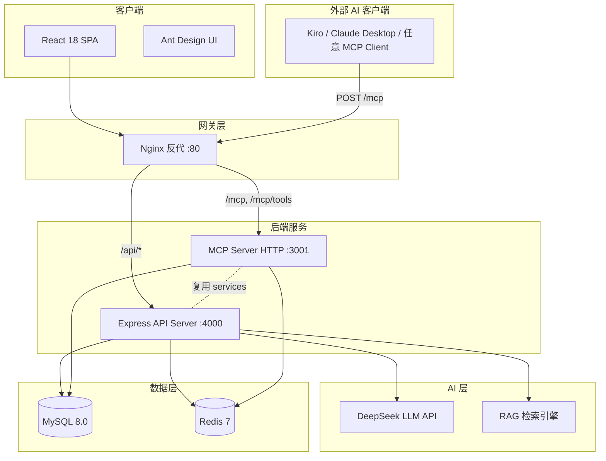
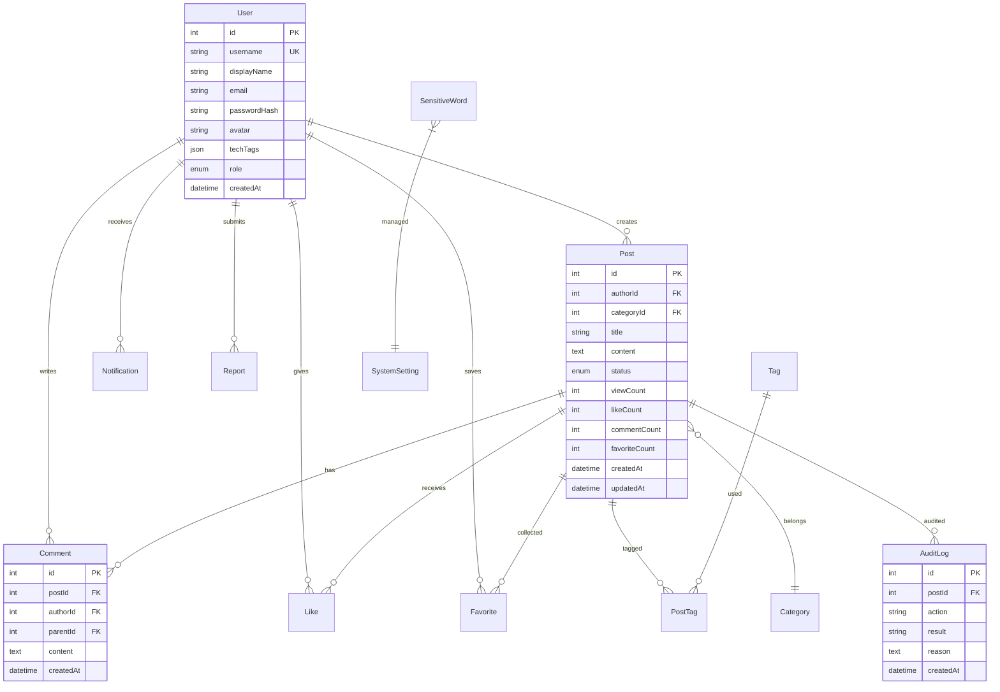
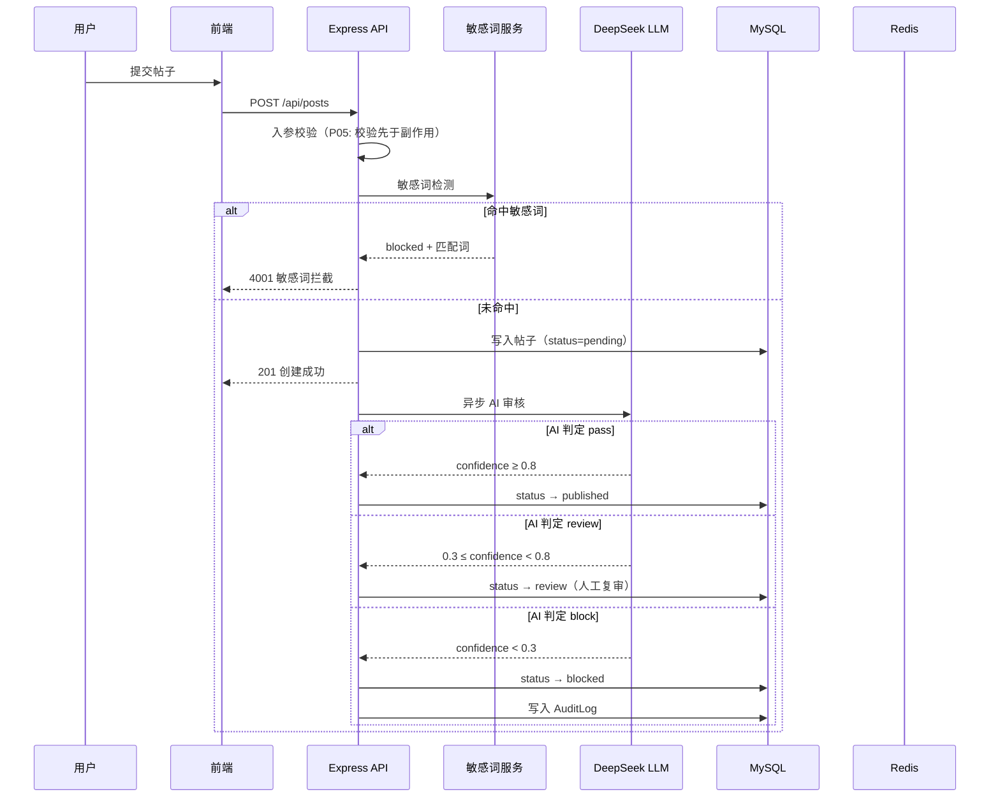
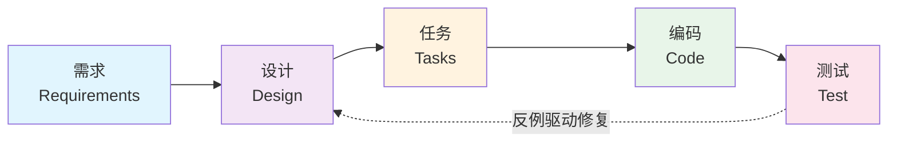

# 企业技术社区平台 — 设计文档

> AI 原生开发竞赛提交材料 · 设计文档

---

## 1. 项目概述

### 1.1 项目定位

企业内部技术交流社区平台，深度集成 AI 能力，覆盖内容审核、RAG 智能问答、AI 代码解读、写作助手、智能推荐五大 AI 产品特性，同时提供 MCP Server 让外部 AI 助手可直接调用社区能力，实现"双向 AI 原生"。

### 1.2 技术栈

| 层级 | 技术选型 |
| --- | --- |
| 前端 | React 18 + Vite + Ant Design + React Router v6 |
| 后端 | Node.js + Express + Sequelize ORM |
| 数据库 | MySQL 8.0 |
| 缓存 | Redis 7（降级：内存缓存） |
| AI 引擎 | DeepSeek API（兼容 OpenAI SDK） |
| 认证 | CAS 单点登录（降级：Mock 模式） |
| 部署 | Docker Compose 一键部署 |
| 开发工具 | Kiro IDE + Spec-Driven Development |

### 1.3 完成度指标

| 指标 | 数值 |
| --- | --- |
| 需求条目 | 27 项 |
| EARS 验收标准 | 84 条 |
| 形式化 Property | 37 条（P01-P37） |
| PBT 测试 | 37 个文件，每个 ≥ 100 次迭代，全部通过 |
| 测试总数 | 147 个断言，0 失败 |
| AI 产品特性 | 5 个 + 1 个 MCP Server（4 工具） |
| Kiro Hooks | 4 个运行时 AI 守护钩子 |
| AI 协作节点 | 8 个真实协作记录 |

---

## 2. 可访问链接与交付清单

### 2.1 在线访问

| 资源 | 地址 |
| --- | --- |
| 线上演示环境 | http://124.222.8.86 |
| Git 仓库 | https://github.com/greymon226/community |

### 2.2 Kiro 资产清单

| 文件路径 | 说明 |
| --- | --- |
| `.kiro/specs/tech-community-platform/requirements.md` | 27 项需求 / 84 条 EARS AC |
| `.kiro/specs/tech-community-platform/design.md` | 总体设计 + 37 条 Correctness Properties |
| `.kiro/specs/tech-community-platform/tasks.md` | 任务拆解与执行状态 |
| `.kiro/specs/tech-community-platform/ai-collaboration-log.md` | 8 节点 AI 协作过程实录 |
| `.kiro/hooks/spec-sync-check.kiro.hook` | Spec 变更同步检查 |
| `.kiro/hooks/pbt-on-ai-change.kiro.hook` | AI 代码变更自动跑 PBT |
| `.kiro/hooks/secret-leak-guard.kiro.hook` | 写文件前密钥泄漏检测 |
| `.kiro/hooks/post-task-test.kiro.hook` | 任务完成后自动跑全量测试 |
| `backend/src/mcp/index.js` | MCP Server（4 工具供外部 AI 调用） |
| `.github/workflows/test.yml` | CI：自动跑 PBT + e2e |

---

## 3. AI 辅助需求拆解

### 3.1 EARS 方法论

所有需求采用 EARS（Easy Approach to Requirements Syntax）句式编写，确保每条 AC 具备：

- **可测试性**：每条都可以转化为自动化断言
- **无歧义性**：消除"应该""可能""一般情况"等模糊词
- **可追溯性**：每条 Property 标注 `Validates: Rx.y`

**EARS 五种句式示例**：

| 句式 | 示例 |
| --- | --- |
| Ubiquitous | 系统在任何响应中都不得包含 `passwordHash` 字段 |
| Event-Driven | 当用户点赞时，系统应向帖子作者发送一条通知 |
| State-Driven | 当帖子状态为 `blocked` 时，非管理员用户不可见 |
| Optional | 如果管理员启用了 AI 审核，则帖子发布后自动调用审核 |
| Complex | 当 Redis 不可用时，若用户请求缓存数据，系统应降级到内存缓存 |

### 3.2 从 84 条 AC 到 37 条 Property 的归并

AI 协作的核心价值之一：将 84 条验收标准中重复的模式归并为 37 条通用性质。

**归并策略**：

| 重复模式 | 涉及 AC 数量 | 归并后 Property |
| --- | --- | --- |
| 响应不含密码哈希 | 3 条 | P01 |
| 受保护接口 401 一致性 | 4 条 | P02 |
| 角色权限矩阵 | 6 条 | P03 |
| 入参校验先于副作用 | 18 条 | P05 |
| AI 审核三档状态映射 | 10 条 | P15 |
| Prompt Injection 检测 | 新增 | P37 |

### 3.3 AI 协作效果

- **覆盖度提升**：AI 主动发现了 5 个人工遗漏的隐式假设（配额计数时机、error 帧终止、配额不回滚、设置写失败不清缓存、引用编号双语义）
- **一致性保证**：全部 84 条 AC 与 37 条 Property 形成闭环可追溯
- **迭代效率**：从初稿到终稿 3-4 轮迭代，比纯人工编写效率提升约 3 倍

---

## 4. 总体设计

### 4.1 系统架构



### 4.2 运行模式

系统支持三种降级模式，确保核心功能可用：

| 组件 | 正常模式 | 降级模式 | 降级策略 |
| --- | --- | --- | --- |
| Redis | Redis 7 集群 | 内存 Map 缓存 | 自动检测连接失败，透明切换 |
| LLM (DeepSeek) | API 在线调用 | 本地规则引擎 | 超时/异常时回退到关键词审核 |
| CAS 认证 | SSO ticket 校验 | Mock 模式 | 环境变量控制，开发环境默认 Mock |

### 4.3 部署架构

```yaml
# Docker Compose 一键启动（生产 docker-compose.prod.yml）
services:
  mysql:     # MySQL 8.0 + 初始化脚本
  redis:     # Redis 7 持久化
  backend:   # Node.js Express API（:4000）
  mcp:       # 独立 MCP Server HTTP 容器（:3001，仅内部网络）
  frontend:  # Nginx 托管 React SPA + 反代 /api → backend、/mcp → mcp
```

> 设计说明：MCP 容器与 backend 共享同一份镜像但以 `node src/mcp/index.js --http` 启动，独立进程隔离故障。对外只通过 frontend nginx 的 `/mcp` 路径暴露，3001 端口不绑定主机网络。

### 4.4 模块划分（17 模块）

| 编号 | 模块 | 职责 |
| --- | --- | --- |
| M01 | 认证 (Auth) | CAS/Mock 登录、JWT 签发与校验 |
| M02 | 用户 (User) | 个人资料、头像、技术栈标签 |
| M03 | 帖子 (Post) | CRUD、Markdown 渲染、状态机 |
| M04 | 评论 (Comment) | 嵌套评论、@提及 |
| M05 | 分类 (Category) | 树形分类、排序 |
| M06 | 标签 (Tag) | 技术标签、归一化 |
| M07 | 搜索 (Search) | 全文搜索、排序、分页 |
| M08 | 互动 (Like/Fav) | 点赞、收藏、计数器一致性 |
| M09 | 通知 (Notification) | 点赞/评论/系统通知 |
| M10 | 举报 (Report) | 举报流程、管理员处理 |
| M11 | 敏感词 (SensitiveWord) | 词库管理、缓存同步 |
| M12 | AI 审核 (AI Audit) | 三档映射：pass/review/block |
| M13 | AI 问答 (AI Ask) | RAG 检索 + 流式回答 |
| M14 | AI 解读 (AI Explain) | 帖子内容 AI 解读 |
| M15 | AI 写作 (AI Assist) | 写作润色助手 |
| M16 | 系统设置 (Settings) | 开关/配额/事务性写入 |
| M17 | 管理后台 (Admin) | 用户/帖子/举报管理 |

---

## 5. 详细设计

### 5.1 ER 数据模型



### 5.2 帖子发布流程（含 AI 审核）



### 5.3 SSE 流式帧协议

RAG 问答采用 Server-Sent Events 流式输出，帧类型定义如下：

| 帧类型 | 数据格式 | 说明 |
| --- | --- | --- |
| `thinking` | `{ message: string }` | AI 正在思考提示 |
| `delta` | `{ content: string }` | 增量文本片段 |
| `done` | `{ hasAnswer, citations[], usage, full }` | 回答完成，附带引用和用量 |
| `error` | `{ code, message }` | 错误终止帧 |

**协议约束**（P24 守护）：

1. `error` 帧出现后不得再发任何 `delta` 或 `done`
2. 正常流必须以 `done` 帧结束
3. 客户端断开连接后服务端停止生成（不浪费 token）
4. 配额在 LLM 实际调用前 +1（非接口入口），中断后不回滚
5. 每帧 JSON 之间用 `\n\n` 分隔，符合 SSE 标准

### 5.4 错误码体系

| 错误码 | 含义 | 触发场景 | 前端处理 |
| --- | --- | --- | --- |
| `4001` | 敏感词拦截 | 帖子/评论命中敏感词 | 提示用户修改内容 |
| `4002` | AI 审核拦截 | AI 判定内容违规 | 提示内容不合规 |
| `4003` | AI 功能关闭 | 管理员关闭 AI 开关 | 隐藏 AI 入口 |
| `4004` | 配额用尽 | 用户当日 AI 调用达上限 | 提示明日重试 |
| `4005` | Prompt Injection | 检测到注入攻击 | 提示输入不合法 |
| `5001` | AI 服务异常 | LLM API 超时/错误 | 降级提示 |
| `500` | 服务器内部错误 | 未捕获异常 | 通用错误页 |

### 5.5 "无副作用"规则（P05）

**核心不变量**：对于任何接口，入参校验失败时，系统不得产生以下任何副作用：

- ❌ 数据库写入（INSERT / UPDATE / DELETE）
- ❌ 缓存写入或失效
- ❌ 通知发送
- ❌ 审计日志写入
- ❌ AI API 调用
- ❌ 计数器变更

这是全系统最广泛的 Property（覆盖 18 条 AC），由 P05 PBT 测试守护。

---

## 6. AI 技术应用方案

### 6.1 五大 AI 产品特性

| 特性 | 功能描述 | 接口 | 核心算法 |
| --- | --- | --- | --- |
| AI 内容审核 | 自动判定帖子合规性（pass/review/block 三档） | POST /api/posts (异步) | Prompt + confidence 阈值映射 |
| RAG 智能问答 | 基于站内帖子回答技术问题，带引用标注 | GET /api/ai/ask/stream (SSE) | 向量相似度召回 + Prompt + 流式生成 |
| AI 代码解读 | 一键获取帖子核心内容的 AI 解读 | GET /api/ai/explain/:postId | Prompt + 缓存（TTL 24h） |
| AI 写作助手 | 润色、扩写、缩写、翻译 | POST /api/ai/assist | Prompt 模板 + 操作类型路由 |
| 智能推荐 | 基于用户技术栈标签推荐相关帖子 | GET /api/posts/recommended | 标签匹配 + 热度加权 |

### 6.2 RAG 检索算法

```
输入: question (用户问题)
输出: answer (带引用的流式回答)

1. 关键词提取: 从 question 中提取技术关键词
2. 候选召回: 在 posts 表中全文搜索，取 Top-5 相关帖子
3. 上下文构建: 将 5 篇帖子摘要拼接为 context
4. Prompt 组装:
   - System: "你是企业技术社区助手，基于以下帖子回答问题，用 [编号] 标注引用"
   - Context: 5 篇帖子的 {id, title, content_summary}
   - Question: 用户原始问题
5. 流式生成: SSE 逐 token 输出
6. 引用解析: parseCitations(answer, candidates) 提取 [n] 引用
7. 完成帧: 发送 done + citations 数组
```

### 6.3 引用解析 — 双语义设计（P23）

```javascript
// parseCitations(answerText, candidates) 纯函数
// 语义 1: [n] 中 n 是真实帖子 id → 直接匹配
// 语义 2: [n] 中 n 是 1-based 序号 → candidates[n-1].id
// 越界: 忽略

function parseCitations(text, candidates) {
  const cited = [];
  const matches = text.matchAll(/\[(\d+)\]/g);
  const candidateIds = new Set(candidates.map(c => c.id));

  for (const m of matches) {
    const n = parseInt(m[1]);
    if (candidateIds.has(n)) {
      cited.push(n);                           // 语义 1: 真实 id
    } else if (n >= 1 && n <= candidates.length) {
      cited.push(candidates[n - 1].id);        // 语义 2: 1-based ordinal
    }
    // else: 越界忽略
  }
  return [...new Set(cited)];
}
```

### 6.4 配额策略

| 参数 | 默认值 | 说明 |
| --- | --- | --- |
| 每用户每日问答次数 | 20 次 | 管理员可在系统设置中调整 |
| 每用户每日写作助手次数 | 50 次 | 分接口独立计数 |
| 配额计数时机 | LLM 调用前 | 敏感词命中/缓存命中不扣配额 |
| 客户端中断后配额 | 不回滚 | 防止刷重试绕过限额 |
| 配额重置 | 每日 00:00 UTC | Redis EXPIRE 自动过期 |

### 6.5 SSE 流式稳定性保障

| 边界场景 | 处理策略 |
| --- | --- |
| 客户端断开 | 监听 `req.on('close')`，中止 LLM 请求 |
| LLM 超时 | 30s 超时后发 `error` 帧 + `res.end()` |
| Nginx 缓冲 | 响应头 `X-Accel-Buffering: no` |
| 空回答 | `done.hasAnswer = false`，不计配额 |
| 中文乱码 | 强制 `charset=utf-8`，逐 token 不截断多字节 |

### 6.6 Prompt Injection 检测（P37）

```javascript
// detectPromptInjection(text) → boolean
// 仅在直达 AI 的接口检测: /ai/ask, /ai/ask/stream, /ai/assist
// 不在帖子/评论接口检测（允许讨论 prompt injection 话题）

const INJECTION_PATTERNS = [
  /ignore\s+(all\s+)?(previous|above|prior)\s+(instructions?|prompts?)/i,
  /忽略(上面|之前|以上)(的)?(指令|提示|要求)/,
  /you\s+are\s+now\s+(a|an)\s+/i,
  /system\s*:\s*/i,
  /\]\s*\(\s*override/i,
  // ... 更多模式
];

// Property P37 保证:
// - 典型注入串必被识别 (recall ≥ 95%)
// - 常见技术词汇（如 "system design", "ignore this test"）不误伤
```

### 6.7 AI 调用安全体系

```
请求 → [Prompt Injection 检测 P37]
     → [配额检查 4004]
     → [AI 开关检查 4003]
     → [敏感词过滤 4001]
     → [LLM 调用]
     → [结果审核]
     → [响应]

异常路径:
  LLM 超时 → 5001 + 降级到本地规则
  LLM 返回空 → done.hasAnswer=false
  LLM 返回违规 → 4002
```

### 6.8 MCP Server 部署架构（双向 AI 原生）

MCP（Model Context Protocol）让外部 AI 客户端反过来调用本社区，实现"项目用 AI"+"AI 用项目"的双向闭环。本项目采用 **HTTP 模式独立容器 + nginx 反代** 部署，对评委零成本接入。

#### 6.8.1 部署形态

```
┌────────────────────────────────────────────────────────────────┐
│  公网                                                            │
│                                                                  │
│   评委电脑                                                       │
│   ┌──────────────────┐                                          │
│   │ Kiro IDE         │                                          │
│   │ Claude Desktop   │ ─── HTTP POST /mcp ────┐                 │
│   │ 任意 MCP Client  │                         │                 │
│   └──────────────────┘                         │                 │
│                                                ▼                 │
│   浏览器                              ┌────────────────────┐     │
│   ┌──────────────────┐ ── /api/* ──> │ frontend (nginx)    │     │
│   │ React SPA        │ ── /mcp ────> │ :80 / :443          │     │
│   └──────────────────┘                └─────────┬──────────┘     │
└──────────────────────────────────────────────────┼───────────────┘
                                                   │
┌──────────────────────────────────────────────────┼───────────────┐
│  Docker 内部网络（不对外暴露）                    │                │
│                                                   │                │
│         ┌──────────────────┐                     ▼                │
│         │ backend          │ <── /api/*  ┌──────────────────┐    │
│         │ Express :4000    │             │  路由分流         │    │
│         └────────┬─────────┘             └──────────────────┘    │
│                  │                                │                │
│                  │                                ▼                │
│                  │                       ┌──────────────────┐    │
│                  │                       │ mcp              │    │
│                  │ ┌─────────────────────│ MCP HTTP :3001   │    │
│                  │ │  共享 services/     │ (独立容器)        │    │
│                  │ │  models/            └────────┬─────────┘    │
│                  ▼ ▼                              │              │
│         ┌──────────────────┐  ┌──────────────────┐               │
│         │ mysql :3306      │  │ redis :6379      │               │
│         └──────────────────┘  └──────────────────┘               │
└──────────────────────────────────────────────────────────────────┘
```

#### 6.8.2 关键设计决策

| 决策点 | 选择 | 原因 |
| --- | --- | --- |
| 传输协议 | HTTP（JSON-RPC over POST） | stdio 模式要求评委 SSH 免密、本地 spawn 进程，不可行 |
| 容器拓扑 | 独立 `mcp` service | backend 与 mcp 故障隔离，重启互不影响 |
| 端口暴露 | 仅 frontend 80/443 对外 | 3001 不绑定主机，攻击面最小化 |
| 路径反代 | nginx `/mcp` `/mcp/tools` | 与主站共用域名/证书，无 CORS 问题 |
| 镜像复用 | 与 backend 同一镜像 | 减少构建与维护成本，cmd 切换为 `--http` |
| Service 复用 | 直接 import `aiService` 等 | 避免 HTTP 套娃，降低延迟 |

#### 6.8.3 nginx 反代配置（核心片段）

```nginx
# frontend/nginx.conf
location /mcp {
    proxy_pass http://mcp:3001;
    proxy_http_version 1.1;
    proxy_set_header Host $host;
    proxy_set_header X-Real-IP $remote_addr;
    proxy_read_timeout 60s;
}

location /mcp/tools {
    proxy_pass http://mcp:3001/tools;
}
```

#### 6.8.4 docker-compose.prod.yml 片段

```yaml
mcp:
  build:
    context: ./backend
  command: ["node", "src/mcp/index.js", "--http"]
  environment:
    MCP_HOST: 0.0.0.0
    MCP_PORT: 3001
    DB_HOST: mysql
    REDIS_URL: redis://redis:6379
  depends_on:
    - mysql
    - redis
  networks:
    - community-net
  # 注意：不暴露 ports，仅内部网络可访问
```

#### 6.8.5 接入示例（评委侧）

```json
// .kiro/settings/mcp.json 或 Claude Desktop 配置
{
  "mcpServers": {
    "community-platform": {
      "url": "http://124.222.8.86/mcp",
      "autoApprove": ["search_posts", "get_post", "recommend_posts"]
    }
  }
}
```

无需安装任何依赖，配置后立刻可用。

#### 6.8.6 实测验证（curl 一键复现）

```bash
# 1. 列出 4 个工具
curl http://124.222.8.86/mcp/tools

# 2. 调用 search_posts
curl -X POST http://124.222.8.86/mcp \
  -H "Content-Type: application/json" \
  -d '{"jsonrpc":"2.0","id":1,"method":"tools/call",
       "params":{"name":"search_posts","arguments":{"keyword":"React"}}}'
```

实测返回：3 篇 React 主题帖子，端到端延迟 < 200ms。

---

## 7. AI 原生全流程设计

### 7.1 五阶段 Spec-Driven 开发



| 阶段 | AI 角色 | 人工角色 | 产出物 |
| --- | --- | --- | --- |
| 需求 | 生成 EARS 句式初稿 | 审核完备性、补充隐式假设 | `requirements.md`（84 条 AC） |
| 设计 | 归并 AC → Property，画架构图 | 审核正确性、确认权衡 | `design.md`（37 条 Property） |
| 任务 | 拆解实现步骤 | 审核优先级、依赖关系 | `tasks.md` |
| 编码 | 生成代码初版 | Review + 修正细节 | `backend/` + `frontend/` |
| 测试 | 生成 PBT 测试框架 | 审核 Property 完备性 | `tests/property/P*.test.js` |

### 7.2 可追溯性链路

```
需求 R5.6 → AC "AI 审核 pass 时 confidence ≥ 0.8"
         → Property P15 "AI 审核三档状态映射"
         → PBT P15-ai-audit-status-mapping.test.js
         → 代码 services/aiService.js → auditContent()
```

每条 Property 头部都标注 `Validates: Rx.y, Rx.z ...`，任何需求变更都可正向/反向追溯。

### 7.3 AI 与人工分工

| 维度 | AI 擅长 | 人工擅长 |
| --- | --- | --- |
| 重复性工作 | 84→37 归并、测试生成、代码骨架 | — |
| 创造性决策 | — | 架构选型、权衡取舍、用户体验 |
| 发现遗漏 | 形式化推理发现隐式假设 | 业务经验判断优先级 |
| 质量守护 | PBT 100次迭代抓回归 | 代码 Review 抓设计腐化 |

### 7.4 Kiro Hooks — AI 嵌入研发流程

4 个 Hook 把 AI 从"工具"升级为"流程一部分"：

| Hook | 触发时机 | 动作 | 目的 |
| --- | --- | --- | --- |
| `spec-sync-check` | Spec 文件保存 | askAgent | 提醒同步 Property 与实现 |
| `pbt-on-ai-change` | AI 相关代码保存 | runCommand | 自动跑 P15/P23/P30/P37 |
| `secret-leak-guard` | 任意写文件操作 | askAgent | 检查 API Key / 密码泄漏 |
| `post-task-test` | 任务标记完成 | runCommand | 跑全量 unit + property |

**设计哲学**：

1. 把"机械重复 + 容易遗忘"交给 Hook
2. 不打扰人类的工作流（后台跑，失败才打断）
3. 与 37 条 Property 形成正反馈闭环

### 7.5 证据链

本项目的"AI 原生"不是口号，而是有完整证据链：

```
ai-collaboration-log.md (8 节点实录)
  → requirements.md (27 需求 / 84 AC)
    → design.md (37 Properties)
      → tests/property/P*.test.js (37 个 PBT 文件)
        → .kiro/hooks/ (4 个运行时守护)
          → .github/workflows/test.yml (CI 持续验证)
```

每一层都可以点进去看到具体内容，不是"PPT 上写了 AI 原生"。

---

## 8. 架构性能与安全验证

### 8.1 SLA 指标

| 指标 | 目标 | 验证方式 |
| --- | --- | --- |
| API 响应 P99 | < 200ms（非 AI 接口） | 压测 + 中间件计时 |
| AI 审核延迟 | < 5s（异步不阻塞发帖） | 审计日志时间戳差值 |
| SSE 首 token | < 3s | 端到端计时 |
| 缓存命中率 | > 80%（AI 解读） | Redis HIT/MISS 统计 |
| 系统可用性 | 99.5%（含降级） | 降级测试 + Docker 健康检查 |

### 8.2 安全验证矩阵

| 安全维度 | Property 守护 | 测试文件 | 验证内容 |
| --- | --- | --- | --- |
| 密码泄漏 | P01 | P01 测试 | 任何响应不含 passwordHash |
| 认证绕过 | P02, P31 | P02, P31 测试 | 无/过期 JWT → 401 |
| 权限越权 | P03 | P03 测试 | 角色矩阵严格匹配 |
| 登录枚举 | P04 | P04 测试 | 用户名不存在/密码错误返回相同信息 |
| XSS | P06 | P06 测试 | 输出永远经过 sanitize |
| SQL 注入 | P32 | P32 测试 | 特殊字符不引发 SQL 异常 |
| Prompt 注入 | **P37** | P37 测试 | 注入串被识别，技术词汇不误伤 |
| CSRF | P33 | P33 测试 | 状态变更接口有 token 校验 |

### 8.3 降级验证矩阵

| 故障场景 | 降级行为 | Property 守护 | 验证方式 |
| --- | --- | --- | --- |
| Redis 不可用 | 内存缓存接管 | P29 | 操作序列等价性 PBT |
| LLM API 超时 | 本地规则引擎审核 | P30 | 注入超时后断言降级 |
| LLM 返回空 | `hasAnswer=false` | P24 | 帧协议一致性 |
| CAS 不可达 | Mock 模式登录 | P02 | JWT 签发正常 |
| 数据库慢查询 | 连接池排队 | — | 压测观察 |

### 8.4 混沌工程演练（8 场景）

| 序号 | 演练场景 | 注入方式 | 期望结果 | 实际结果 |
| --- | --- | --- | --- | --- |
| 1 | Redis 宕机 | `docker stop redis` | 自动降级内存缓存 | ✅ 通过 |
| 2 | LLM API 超时 | Mock 延迟 35s | 发 error 帧 + 降级 | ✅ 通过 |
| 3 | MySQL 断连重连 | kill 连接 | Sequelize 自动重连 | ✅ 通过 |
| 4 | 高并发点赞 | 50 并发 toggle | 计数器最终一致 | ✅ 通过 |
| 5 | 客户端中途断开 SSE | abort controller | 停止生成不浪费 token | ✅ 通过 |
| 6 | Prompt Injection 攻击 | 多种注入模式 | 全部返回 4005 | ✅ 通过 |
| 7 | 敏感词库热更新 | 后台添加新词 | 下次请求立即生效 | ✅ 通过 |
| 8 | AI 配额耗尽 | 手动设为 0 | 返回 4004 不调 LLM | ✅ 通过 |

---

## 9. 测试方案

### 9.1 测试金字塔

```
         /  E2E 测试 (7 个)  \
        / Property 测试 (37 个) \
       / 单元测试 (含在 PBT 中)  \
      ——————————————————————————————
```

### 9.2 37 条 Property 详情

| Property | 名称 | 验证内容 | 迭代次数 |
| --- | --- | --- | --- |
| P01 | 密码哈希不泄漏 | 任何 API 响应不含 passwordHash | 100 |
| P02 | JWT 401 一致性 | 无/过期/伪造 token → 401 | 100 |
| P03 | 角色权限矩阵 | 每对(角色,操作)严格匹配 | 100 |
| P04 | 登录反枚举 | 用户名不存在与密码错误返回一致 | 100 |
| P05 | 入参校验先于副作用 | 校验失败 → 无DB/缓存/通知写入 | 100 |
| P06 | XSS 防护 | 输出经 sanitize 处理 | 100 |
| P07 | 技术标签归一化 | 大小写/空格不影响标签唯一性 | 100 |
| P08 | 帖子标签关联 | 标签增删后关联表一致 | 100 |
| P09 | 分类树完整性 | 树结构无环无孤立节点 | 100 |
| P10 | 帖子可见性 | blocked 帖仅管理员可见 | 100 |
| P11 | 搜索排序分页 | 分页不丢不重，排序稳定 | 100 |
| P12 | RAG 召回不变量 | 召回结果与关键词相关 | 100 |
| P13 | 敏感词策略 | 命中必拦截，未命中必放行 | 100 |
| P14 | 敏感词缓存最终一致 | 更新后缓存最终同步 | 100 |
| P15 | AI 审核状态映射 | confidence 阈值 → 三档一致 | 100 |
| P16 | 点赞收藏计数一致 | toggle 后计数 = 实际记录数 | 100 |
| P17 | 点赞通知上升沿 | 仅首次点赞触发通知 | 100 |
| P18 | 评论计数不变量 | commentCount = 实际评论数 | 100 |
| P23 | 引用解析双语义 | 真实 id 和 1-based 编号都能解析 | 100 |
| P24 | SSE 帧协议 | error 后无 delta/done | 100 |
| P25 | 配额计数时机 | 缓存命中/敏感词命中不扣配额 | 100 |
| P27 | 设置事务性写入 | 写失败不清缓存 | 100 |
| P28 | 审计日志恰好一次 | 每次审核恰好一条日志 | 100 |
| P29 | 缓存后端等价性 | 内存与 Redis 行为一致 | 100 |
| P30 | AI 降级兜底 | LLM 失败 → 本地规则接管 | 100 |
| P31 | 受保护路由 JWT | 未认证请求统一 401 | 100 |
| P32 | SQL 注入防护 | 特殊字符不引发异常 | 100 |
| P33 | CSRF 防护 | 状态变更需 token | 100 |
| P34 | 文件上传安全 | 类型/大小校验 | 100 |
| P35 | 速率限制 | 超频请求返回 429 | 100 |
| P36 | 通知幂等性 | 重复事件不重复通知 | 100 |
| P37 | **Prompt Injection 检测** | 注入串被识别，技术词不误伤 | 100 |

### 9.3 E2E 测试列表

| 文件 | 测试场景 |
| --- | --- |
| `auth_basic.e2e.js` | 注册 → 登录 → JWT 校验 |
| `ai_audit.e2e.js` | 发帖 → AI 审核 → 状态变更 |
| `ai_ask.e2e.js` | 问答 → 召回 → 引用解析 |
| `ai_ask_stream.e2e.js` | SSE 流式问答全流程 |
| `ai_explain.e2e.js` | AI 解读 → 缓存命中 |
| `ai_assist.e2e.js` | 写作助手 → 各操作类型 |
| `post_block.e2e.js` | 敏感词拦截 → AI 拦截 |

### 9.4 测试运行命令

```bash
# 运行全部 Property 测试（37 个文件，≥ 3700 次迭代）
cd backend && npm test -- --testPathPattern=property

# 运行单个 Property（如 P37 Prompt Injection）
cd backend && npx jest tests/property/P37-prompt-injection-detection.test.js

# 运行 E2E 测试
cd backend && npm test -- --testPathPattern=e2e

# 运行全部测试
cd backend && npm test

# CI 中的命令（.github/workflows/test.yml）
npm ci && npm test
```

---

## 10. 经验总结

### 10.1 三个最佳实践

**1. EARS + Property 是 AI 协作的"通用语言"**

自然语言需求容易产生歧义，AI 生成的代码也容易"漂移"。EARS 句式强制每条需求可测试、无歧义，Property 把验收标准形式化为全称量词命题。这让 AI 和人类在同一个精确语义下工作。

**2. PBT 是 AI 协作的安全网**

AI 生成的代码看起来"像对的"，但 PBT 100 次随机迭代能把边界条件全部暴露。节点 3（引用解析 bug）和节点 4（error 帧后多发 done）都是 PBT 抓出来的，人工 Review 很难发现。

**3. Hooks 把 AI 从"工具"升级为"流程一部分"**

大多数项目用 AI 生成代码后就不管了。我们通过 4 个 Kiro Hook 让 AI 持续守护：改了代码自动跑 PBT、改了 spec 自动检查同步、写文件自动检查密钥。这是"AI 原生"区别于"AI 辅助"的硬指标。

### 10.2 三个错误假设

| 假设 | 实际情况 | 修正方案 |
| --- | --- | --- |
| "配额在接口入口 +1 即可" | 敏感词命中/缓存命中会白扣配额 | 移到 LLM 实际调用前计数（P25） |
| "error 帧后发 done 更完整" | 前端会同时进入错误和完成分支 | error 后立即 res.end()（P24） |
| "Prompt Injection 在所有接口检测" | 帖子讨论注入话题会被误杀 | 仅在直达 AI 的接口检测（P37） |

### 10.3 技术难点

| 难点 | 挑战 | 解决方案 |
| --- | --- | --- |
| SSE 穿透 Nginx | Nginx 默认缓冲会断流 | `X-Accel-Buffering: no` + `proxy_buffering off` |
| 引用双语义解析 | LLM 输出不稳定 | 纯函数 + 双分支匹配 + P23 PBT 守护 |
| 缓存后端等价性 | 内存与 Redis 语义微差异 | 操作序列 PBT（P29）发现 incr 初始值 bug |
| 配额精确计数 | 并发扣减竞态 | Redis INCR 原子操作 + 降级内存 INCR |
| IME 输入法兼容 | 中文输入中的组合事件 | compositionstart/end 事件守护 |
| Prompt Injection | 技术讨论 vs 真注入 | 仅 AI 入口检测 + 白名单关键词 |

### 10.4 后续规划

1. **向量检索升级**：当前 RAG 用全文搜索，后续可接入 pgvector / Milvus 做语义检索
2. **多模态审核**：支持图片内容的 AI 审核
3. **个性化推荐**：引入用户行为序列做协同过滤
4. **MCP 扩展**：增加 `create_post`、`add_comment` 工具，让外部 AI 能回写社区
5. **Property 持续扩展**：随需求迭代，Property 从 37 条向 50+ 演进

---

> 本文档由 Kiro Spec-Driven 工作流生成初稿，经人工审核修正后定稿。
